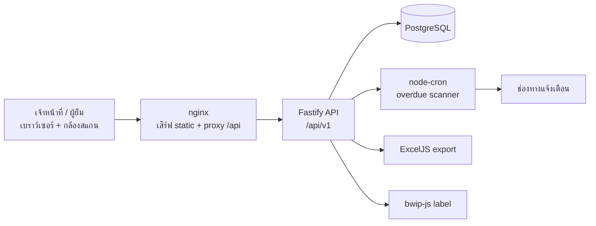

# IpdCharts — ระบบยืม-คืนเวชระเบียนผู้ป่วยใน

ระบบติดตามการยืม-คืนแฟ้มเวชระเบียนผู้ป่วยใน (IPD) สำหรับหน่วยงานเวชระเบียนของโรงพยาบาล
ออกแบบมาแทนการจดสมุด/Excel ด้วยการสแกน QR/Barcode, Dashboard เรียลไทม์ และการแจ้งเตือนแฟ้มเกินกำหนดอัตโนมัติ

> **สถานะ:** ครบทุก Functional Requirement (FR-01 ถึง FR-12) ตาม PRD

---

## ปัญหาที่แก้

| เดิม | หลังใช้ระบบ |
|---|---|
| ไม่รู้ว่าแฟ้มอยู่กับใคร ต้องเปิดสมุดค้น | ค้นจาก HN / ชื่อผู้ป่วย / ชื่อผู้ยืม ได้ทันที |
| ไม่รู้ว่าแฟ้มไหนเลยกำหนดคืน | Dashboard แสดงจำนวนเกินกำหนดแบบเรียลไทม์ |
| ลืมทวงคืน | Cron สแกนทุกชั่วโมง + escalation ถึงหัวหน้าเมื่อค้างนาน |
| ตรวจสอบย้อนหลังไม่ได้ | Audit trail ราย HN + audit log ทุกธุรกรรม |
| ทำรายงานด้วยมือ | Export Excel พร้อมสรุปและไฮไลต์รายการเกินกำหนด |

---

## คุณสมบัติหลัก

### 🔐 การเข้าสู่ระบบและสิทธิ์ (RBAC)

- ล็อกอินด้วย username/password — รหัสผ่านเก็บเป็น bcrypt hash (cost 10)
- JWT (HS256) อายุ 12 ชั่วโมง ตรวจสอบทุก request และโหลดผู้ใช้จากฐานข้อมูลใหม่เสมอ
  (ปิดบัญชี/ลบผู้ใช้แล้ว token เดิมใช้ไม่ได้ทันที)
- ข้อความตอบกลับตอนล็อกอินผิดเหมือนกันทุกกรณี เพื่อกัน user enumeration
- จำกัดจำนวนครั้งการล็อกอิน (ปริยาย 10 ครั้ง/นาที) นับแยกตาม **IP + ชื่อผู้ใช้**
  ไม่ใช่ IP ล้วน เพราะโรงพยาบาลออกเน็ตผ่าน NAT ไม่กี่ IP — ถ้านับต่อ IP
  ช่วงเปลี่ยนเวรที่คนล็อกอินพร้อมกันหลายคนจะโดนบล็อกทั้งที่ไม่ได้ทำอะไรผิด
- เปิดแอปแล้วตรวจ token กับเซิร์ฟเวอร์ทุกครั้ง — token หมดอายุจะเด้งไปหน้าล็อกอินทันที ไม่ค้างสถานะ
- 3 บทบาท:

  | Role | ความหมาย | สิทธิ์ |
  |---|---|---|
  | `ADMIN` | เจ้าหน้าที่เวชระเบียน | ยืม / คืน / พิมพ์ label / ออกรายงาน / ดูทุกอย่าง |
  | `BORROWER` | แพทย์ พยาบาล ผู้ยืม | ดู Dashboard, รายการแฟ้ม, ประวัติ |
  | `DEPARTMENT_HEAD` | หัวหน้าหน่วยงาน | เท่ากับ `BORROWER` + รับ escalation |

### 📤 บันทึกการยืม

- สแกน QR/Barcode ผ่านกล้องมือถือ/แท็บเล็ต (html5-qrcode) หรือพิมพ์ HN เอง — ไม่ต้องใช้ฮาร์ดแวร์เฉพาะ
- ตรวจสอบก่อนบันทึกทุกครั้ง: แฟ้มมีอยู่จริง, ยังว่าง (กันยืมซ้อน), ไม่ได้ชำรุด/สูญหาย,
  ผู้ยืมมีอยู่และสังกัดหน่วยงาน, กำหนดคืนต้องเป็นอนาคต
- เขียนข้อมูลแบบ transaction — สร้างรายการยืม + เปลี่ยนสถานะแฟ้ม + เขียน audit log พร้อมกันหรือไม่เกิดเลย

### ✅ อนุมัติคำขอกรณีพิเศษ

- ติ๊ก "ต้องขออนุมัติก่อนจ่ายแฟ้ม" ตอนบันทึก (เช่น ยืมออกนอกโรงพยาบาล) → รายการเข้าสถานะ **รออนุมัติ**
  และ **ยังไม่จ่ายแฟ้มออก** จนกว่าจะได้รับอนุมัติ
- หัวหน้าหน่วยงานอนุมัติได้เฉพาะคำขอของหน่วยงานตนเอง (เจ้าหน้าที่เวชระเบียนอนุมัติได้ทุกหน่วยงาน)
- ตอนอนุมัติ ระบบเช็คสถานะแฟ้มซ้ำอีกครั้ง เผื่อมีคนยืมไปแล้วระหว่างรออนุมัติ
- ไม่อนุมัติได้พร้อมระบุเหตุผล ซึ่งจะแสดงในรายการและเก็บใน audit log

### 📥 บันทึกการคืน

- สแกนรับคืน ปิดรายการพร้อม timestamp จริง
- บังคับให้ผู้คืนตรงกับผู้ยืม (`WRONG_RETURNER`) และกันการคืนซ้ำ (`ALREADY_RETURNED`)
- คืนแล้วแฟ้มกลับสู่สถานะ `AVAILABLE` อัตโนมัติ
- รับคืนสภาพ "ชำรุด" ได้ในขั้นตอนเดียว — ปิดรายการยืม พักแฟ้มไว้ และเปิดเรื่องติดตามให้อัตโนมัติ

### 🚨 แฟ้มชำรุด / สูญหาย

- รายงานได้ทั้งตอนรับคืน (ชำรุด) และแทนการรับคืน (สูญหาย)
- แฟ้มที่มีเรื่องค้างจะยืมไม่ได้ (`RECORD_UNUSABLE`) จนกว่าจะปิดเรื่อง
- แจ้งเตือนเจ้าหน้าที่เวชระเบียนทุกคน + หัวหน้าหน่วยงานของผู้ยืมทันทีที่เปิดเรื่อง
- ระบบ **หยุดทวงคืน** รายการที่แจ้งสูญหายแล้ว เพราะติดตามผ่านเรื่องที่เปิดไว้แทน
- ปิดเรื่องพร้อมเลือกคืนแฟ้มสู่สถานะพร้อมยืม — ถ้ายังมีเรื่องอื่นค้างอยู่ ระบบจะยังไม่คืนสถานะให้

### 📊 Dashboard เรียลไทม์

- การ์ดสรุป 5 ตัว: แฟ้มทั้งหมด / ว่างให้ยืม / อยู่ระหว่างยืม / เกินกำหนด / คืนวันนี้
- แถบงานค้างที่ต้องมีคนลงมือ (คำขอรออนุมัติ, เรื่องชำรุด/สูญหายที่ยังไม่ปิด) — แสดงเฉพาะเมื่อมีจริง
- ตารางรายการเกินกำหนดพร้อม badge สี
- "คืนวันนี้" นับตามเที่ยงคืนโซน `Asia/Bangkok` ไม่ใช่ย้อนหลัง 24 ชั่วโมง

### 🔔 แจ้งเตือนแฟ้มเกินกำหนด

- Cron ทุกชั่วโมง สแกนรายการที่เลยกำหนด แล้วส่งอีเมลถึง **ผู้ยืมรายคน**
  (จำกัด 3 ครั้ง/รายการ/วัน นับจาก audit log)
- Escalation: จัดกลุ่มรายการที่ค้างเกิน 14 วันตามหน่วยงาน แล้วส่งสรุปถึงหัวหน้าหน่วยงานนั้น
  ถ้าหน่วยงานไม่มีหัวหน้า จะตกไปที่เจ้าหน้าที่เวชระเบียน
- สรุปประจำวันทุก 08:00 น.
- ผู้รับที่ไม่มีอีเมลจะถูกนับเป็น "ส่งไม่ได้" และขึ้น log ให้ตามด้วยมือ — ไม่บันทึกว่าแจ้งเตือนสำเร็จ
- **ช่องทาง:** Email (SMTP) เป็นหลัก ส่วน LINE Messaging API วางโครงไว้พร้อมใช้
  จะทำงานเมื่อตั้ง `LINE_CHANNEL_ACCESS_TOKEN` และผู้ใช้มี `lineUserId`
  (LINE Notify ตัวเดิมถูก LINE ปิดบริการถาวรแล้ว จึงไม่ได้ใช้)

### 📁 ค้นหาแฟ้มและ Audit Trail

- ค้นหาแบบ substring จาก HN, ชื่อผู้ป่วย หรือชื่อผู้ยืม + กรองตามสถานะ
- หน้ารายละเอียดแฟ้มแสดงผู้ถือครองปัจจุบัน และประวัติการยืม-คืนทั้งหมดของแฟ้มนั้น
- ตาราง `AuditLog` บันทึกทุกธุรกรรมพร้อมผู้กระทำและ payload — รวมถึง **การอ่านข้อมูลผู้ป่วย**
  (`RECORD_SEARCH`, `RECORD_VIEW`) ตามข้อกำหนด PDPA

  <details>
  <summary>รายการ action ทั้งหมด</summary>

  `LOGIN`, `BORROW`, `BORROW_REQUEST`, `BORROW_APPROVE`, `BORROW_REJECT`, `RETURN`,
  `INCIDENT_REPORT`, `INCIDENT_RESOLVE`, `USER_CREATE`, `USER_UPDATE`, `USER_DEACTIVATE`,
  `DEPARTMENT_CREATE`, `DEPARTMENT_UPDATE`, `DEPARTMENT_DELETE`,
  `RECORD_SEARCH`, `RECORD_VIEW`, `OVERDUE_NOTIFICATION`, `OVERDUE_ESCALATION`
  </details>

### 👥 จัดการผู้ใช้งาน

- เพิ่ม / แก้ไข / รีเซ็ตรหัสผ่าน / เปิด-ปิดใช้งานบัญชี พร้อมกำหนดบทบาทและหน่วยงาน
- **ปิดใช้งานแทนการลบ** เพราะ audit log และประวัติการยืมอ้างถึงผู้ใช้อยู่ — ลบจริงจะทำให้ตรวจสอบย้อนหลังไม่ได้
- ปิดใช้งานแล้ว token เดิมใช้ไม่ได้ทันที และล็อกอินใหม่ไม่ได้
- กันปิดบัญชีตัวเอง และกันปิดบัญชีที่ยังมีแฟ้มค้างคืน
- รหัสผ่านไม่เคยถูกบันทึกลง audit log — เก็บแค่ว่ามีการเปลี่ยนหรือไม่

### 🏢 จัดการหน่วยงาน

- เพิ่ม / เปลี่ยนชื่อ / ลบหน่วยงาน พร้อมกันชื่อซ้ำ
- **ลบได้เฉพาะหน่วยงานที่ไม่มีอะไรอ้างถึง** — ถ้ายังมีผู้ใช้หรือประวัติการยืมอยู่ ระบบจะปฏิเสธ
  พร้อมบอกจำนวนที่อ้างอยู่ ประวัติจึงไม่ขาดหาย (ปุ่มลบใน UI ถูกปิดไว้ล่วงหน้าด้วย)

### 📄 รายงาน Excel

- หน้ารายงานเลือกช่วงวันที่และสถานะ แล้วดาวน์โหลด `.xlsx` ได้ทันที (ExcelJS)
- จัดรูปแบบหัวตาราง, ไฮไลต์แถวเกินกำหนด, วันที่แสดงแบบไทย
- มีบรรทัดสรุปจำนวนรายการและเวลาที่สร้างรายงาน

### 🏷️ พิมพ์ label QR/Barcode

- สร้าง PNG ของ Code128 หรือ QR จาก HN ผ่าน bwip-js สำหรับติดแฟ้มที่ยังไม่มีบาร์โค้ด
- หน้าจอมีตัวอย่างก่อนพิมพ์ ดาวน์โหลด PNG และสั่งพิมพ์ได้
- รองรับการขอเป็นชุด (batch) สำหรับพิมพ์ทีละหลายแฟ้ม

### 🌐 UI

- ภาษาไทยทั้งหมด รวมถึงข้อความ error ที่ส่งมาจาก API
- Responsive — sidebar บนจอใหญ่, แถบบนบนมือถือ
- เมนูซ่อน/แสดงตามสิทธิ์ และมี route guard ฝั่ง client

---

## Tech Stack

| ชั้น | เทคโนโลยี |
|---|---|
| Frontend | React 19 + Vite 6 + TypeScript + TailwindCSS 4 + React Router 7 |
| Backend | Fastify 5 + TypeScript (ESM) |
| Database | PostgreSQL 16 + Prisma 6 |
| Auth | JWT (jose) + bcryptjs |
| สแกน | html5-qrcode |
| Label | bwip-js |
| รายงาน | ExcelJS |
| งานตามเวลา | node-cron |
| Validation | Zod |
| Test | `bun test` (integration) + Playwright (E2E) |
| Deploy | Docker Compose (nginx + Bun + PostgreSQL) |

TypeScript strict mode ทั้งโปรเจกต์ — ไม่มี `any`, `@ts-ignore` หรือ `@ts-expect-error`

---

## สถาปัตยกรรม



---

## เริ่มต้นใช้งาน (Development)

**ต้องมี:** [Bun](https://bun.sh) 1.2+ และ Docker

```bash
# 1) ติดตั้ง dependencies (bun workspace — ติดตั้งครั้งเดียวจาก root)
bun install

# 2) เปิดฐานข้อมูล (map host 5433 -> container 5432)
docker compose up -d db

# 3) ตั้งค่า environment
cp .env.example .env                 # สำหรับ docker compose
cp backend/.env.example backend/.env # สำหรับ dev server
# แก้ JWT_SECRET ให้ยาวอย่างน้อย 32 ตัวอักษร

# 4) สร้างตารางและใส่ข้อมูลตัวอย่าง
bun run db:migrate
bun run db:seed

# 5) รัน backend (:3000) + frontend (:5173) พร้อมกัน
bun run dev
```

เปิด http://localhost:5173 — Vite proxy `/api` ไปที่ `localhost:3000` ให้อัตโนมัติ

### บัญชีสำหรับทดลอง

หลังรัน `bun run db:seed` (รหัสผ่านเดียวกันทุกบัญชี: `password123`)

| Username | บทบาท | ชื่อ |
|---|---|---|
| `mr-admin` | ADMIN | นางสาวสมหญิง เจ้าหน้าที่เวชระเบียน |
| `nurse-mali` | BORROWER | นางสาวมาลี พยาบาล (ศัลยกรรม) |
| `dr-wichai` | BORROWER | นายแพทย์วิชัย แพทย์ (ICU) |
| `head-somchai` | DEPARTMENT_HEAD | นายสมชาย หัวหน้าศัลยกรรม |

ข้อมูลตัวอย่างมี 3 หน่วยงาน, 12 แฟ้ม, รายการยืม 4 แบบ (เกินกำหนด / ปกติ / คืนแล้ว / รออนุมัติ)
และเรื่องแฟ้มชำรุดที่ยังไม่ปิด 1 รายการ — ครอบทุกสถานะที่ UI รองรับ

> ⚠️ บัญชีเหล่านี้มีไว้สำหรับ dev เท่านั้น — อย่ารัน `db:seed` บนฐานข้อมูลจริง เพราะ seed จะ **ลบข้อมูลเดิมทั้งหมด** ก่อนใส่ข้อมูลใหม่

---

## Deploy (Production)

```bash
cp .env.example .env
# ตั้ง POSTGRES_PASSWORD และ JWT_SECRET เป็นค่าจริง (JWT_SECRET ต้อง >= 32 ตัวอักษร)

docker compose up -d --build
```

- frontend → `http://<host>` (พอร์ต 80)
- backend  → `http://<host>:3000/api/v1`
- คอนเทนเนอร์ backend รัน `prisma migrate deploy` ให้อัตโนมัติก่อนเปิดรับ request
- ถ้า `JWT_SECRET` ไม่ได้ตั้งหรือสั้นเกินไป backend จะปฏิเสธการ start พร้อมข้อความบอกสาเหตุ

**หมายเหตุการ build:** ทั้งสอง image ใช้ build context เป็น root ของ repo เพราะ `bun.lock` ของ workspace อยู่ที่ root

### ตัวแปร Environment

| ตัวแปร | ใช้ที่ | ค่าเริ่มต้น | หมายเหตุ |
|---|---|---|---|
| `POSTGRES_USER` | compose | `ipd` | |
| `POSTGRES_PASSWORD` | compose | `ipd_dev_password` | **ต้องเปลี่ยนบน production** |
| `POSTGRES_DB` | compose | `ipdcharts` | |
| `DATABASE_URL` | backend | — | connection string ของ Prisma |
| `JWT_SECRET` | backend | — | **บังคับ**, อย่างน้อย 32 ตัวอักษร |
| `PORT` | backend | `3000` | |
| `SMTP_HOST` | backend | ว่าง | ไม่ตั้ง = ไม่ส่งอีเมลแจ้งเตือน |
| `SMTP_PORT` | backend | `587` | |
| `SMTP_SECURE` | backend | `false` | ตั้ง `true` เมื่อใช้ TLS ตรง (พอร์ต 465) |
| `SMTP_USER` / `SMTP_PASS` | backend | ว่าง | เว้นว่างได้ถ้า relay ภายในไม่ต้อง auth |
| `SMTP_FROM` | backend | `IpdCharts <no-reply@ipdcharts.local>` | ผู้ส่งที่แสดงในอีเมล |
| `LINE_CHANNEL_ACCESS_TOKEN` | backend | ว่าง | เปิดใช้ LINE Messaging API (ไม่บังคับ) |
| `CORS_ORIGIN` | backend | ว่าง | คั่นด้วย comma — ไม่ตั้งบน production = same-origin เท่านั้น |
| `AUTH_RATE_LIMIT_MAX` | backend | `10` | จำนวนครั้งล็อกอินต่อ IP, `0` = ปิด |
| `AUTH_RATE_LIMIT_WINDOW` | backend | `1 minute` | ช่วงเวลาที่นับ |
| `IPDCHARTS_TEST_DATABASE_URL` | test | `...localhost:5433/ipdcharts_test` | |

---

## API

ทุก endpoint อยู่ใต้ `/api/v1` และต้องแนบ `Authorization: Bearer <token>` ยกเว้นที่ระบุว่าไม่ต้อง

| Method | Path | สิทธิ์ | คำอธิบาย |
|---|---|---|---|
| `GET` | `/health` | สาธารณะ | health check |
| `POST` | `/auth/login` | สาธารณะ | ล็อกอิน คืน token + ข้อมูลผู้ใช้ |
| `GET` | `/auth/me` | ทุก role | ข้อมูลผู้ใช้ปัจจุบัน (ใช้ตรวจ token) |
| `GET` | `/stats` | ทุก role | ตัวเลขสรุปสำหรับ Dashboard |
| `GET` | `/medical-records` | ทุก role | ค้นหาแฟ้ม (`?search=`, `?status=`) |
| `GET` | `/medical-records/:id` | ทุก role | รายละเอียด + ประวัติ + เหตุการณ์ชำรุด/สูญหาย |
| `GET` | `/borrows` | ทุก role | รายการยืม (`?status=PENDING_APPROVAL\|ACTIVE\|RETURNED\|REJECTED\|OVERDUE`, `?search=`) |
| `POST` | `/borrows` | ADMIN | บันทึกการยืม (`requiresApproval: true` = ส่งเป็นคำขอ) |
| `POST` | `/borrows/:id/approve` | ADMIN, DEPARTMENT_HEAD | อนุมัติคำขอยืม |
| `POST` | `/borrows/:id/reject` | ADMIN, DEPARTMENT_HEAD | ไม่อนุมัติ (ต้องระบุ `reason`) |
| `POST` | `/borrows/:id/return` | ADMIN | บันทึกการคืน (`condition: "DAMAGED"` = เปิดเรื่องด้วย) |
| `GET` | `/incidents` | ทุก role | รายการแฟ้มชำรุด/สูญหาย (`?status=`, `?type=`) |
| `POST` | `/incidents` | ADMIN | รายงานแฟ้มชำรุด/สูญหาย |
| `POST` | `/incidents/:id/resolve` | ADMIN | ปิดเรื่อง (`restoreRecord` = คืนแฟ้มสู่สถานะพร้อมยืม) |
| `GET` | `/users` | ทุก role | รายชื่อผู้ใช้งาน (`?includeInactive=true`) |
| `POST` | `/users` | ADMIN | เพิ่มผู้ใช้งาน |
| `PATCH` | `/users/:id` | ADMIN | แก้ไข / รีเซ็ตรหัสผ่าน / เปิด-ปิดใช้งาน |
| `DELETE` | `/users/:id` | ADMIN | ปิดใช้งานบัญชี (ไม่ลบข้อมูลจริง) |
| `GET` | `/departments` | ทุก role | รายชื่อหน่วยงาน + จำนวนผู้ใช้/ประวัติการยืม |
| `POST` | `/departments` | ADMIN | เพิ่มหน่วยงาน |
| `PATCH` | `/departments/:id` | ADMIN | เปลี่ยนชื่อหน่วยงาน |
| `DELETE` | `/departments/:id` | ADMIN | ลบหน่วยงาน (เฉพาะที่ไม่มีอะไรอ้างถึง) |
| `GET` | `/labels` | ADMIN | PNG barcode/QR (`?hn=&type=barcode\|qrcode`) |
| `POST` | `/labels/batch` | ADMIN | ขอ label หลายแฟ้ม |
| `GET` | `/reports/borrows` | ADMIN | ดาวน์โหลดรายงาน `.xlsx` |

### รูปแบบ error

ทุก error ตอบกลับรูปแบบเดียวกัน พร้อมข้อความภาษาไทยที่แสดงให้ผู้ใช้ได้ทันที

```json
{ "error": { "code": "RECORD_NOT_AVAILABLE", "message": "แฟ้มนี้ถูกยืมอยู่แล้ว ไม่สามารถยืมซ้ำได้" } }
```

โค้ดที่ใช้: `VALIDATION_ERROR`, `UNAUTHORIZED`, `FORBIDDEN`, `TOO_MANY_REQUESTS`, `INVALID_CREDENTIALS`,
`RECORD_NOT_FOUND`, `RECORD_NOT_AVAILABLE`, `RECORD_UNUSABLE`, `BORROW_NOT_FOUND`, `ALREADY_RETURNED`,
`WRONG_RETURNER`, `BORROWER_NOT_FOUND`, `BORROWER_NO_DEPARTMENT`, `INVALID_DUE_DATE`,
`NOT_PENDING_APPROVAL`, `NOT_APPROVED`, `APPROVER_WRONG_DEPARTMENT`, `INCIDENT_NOT_FOUND`,
`INCIDENT_ALREADY_RESOLVED`, `USERNAME_TAKEN`, `DEPARTMENT_NOT_FOUND`, `DEPARTMENT_NAME_TAKEN`,
`DEPARTMENT_IN_USE`, `CANNOT_DELETE_SELF`, `USER_HAS_ACTIVE_BORROWS`, `USER_NOT_FOUND`,
`NOT_FOUND`, `INTERNAL_ERROR`

---

## กติกาทางธุรกิจ

| กติกา | ค่า | อ้างอิง |
|---|---|---|
| ผ่อนผันก่อนนับว่าเกินกำหนด | 7 วันหลัง `dueDate` | `OVERDUE_GRACE_DAYS` |
| เกณฑ์ escalation ถึงหัวหน้า | เกินกำหนด 14 วัน | `ESCALATION_DAYS` |
| จำกัดการแจ้งเตือน | 3 ครั้ง/รายการ/วัน | `MAX_NOTIFICATIONS_PER_BORROW` |
| อายุ token | 12 ชั่วโมง | `TOKEN_TTL_SECONDS` |
| รอบสแกนเกินกำหนด | ทุกชั่วโมง (นาทีที่ 0) | `server.ts` |
| รอบสรุปประจำวัน | 08:00 น. | `server.ts` |
| Time zone แสดงผล | `Asia/Bangkok` (เก็บใน DB เป็น UTC) | |
| รูปแบบ HN | ตัวเลข 8–10 หลัก | `borrowBodySchema` |
| ความยาวรหัสผ่านขั้นต่ำ | 8 ตัวอักษร | `createBodySchema` |
| ลิมิตล็อกอิน (ต่อ IP + ชื่อผู้ใช้) | 10 ครั้ง/นาที | `AUTH_RATE_LIMIT_MAX` |
| แฟ้มที่ยืมได้ | เฉพาะสถานะ `AVAILABLE` และไม่มีคำขอค้างอยู่ | `isRecordBorrowable` |

---

## การทดสอบ

```bash
bun run typecheck   # tsc --noEmit ทั้ง backend และ frontend
bun run test        # integration tests (ต้องมี PostgreSQL รันอยู่)
```

Integration test ยิงผ่าน `app.inject()` ไปยัง Fastify จริงและใช้ PostgreSQL จริง (ฐาน `ipdcharts_test`)
ครอบคลุม happy path, กรณี error ทุกแบบ, workflow อนุมัติ, เหตุการณ์ชำรุด/สูญหาย, จัดการผู้ใช้,
overdue scanner, audit log การอ่าน และ rate limit
ทุกเทสต์ผ่าน **auth/RBAC จริง** — ออก JWT ผ่านเส้นทางเดียวกับ production ไม่มีการ bypass

### E2E (Playwright)

E2E ขับเบราว์เซอร์จริงครอบทุกหน้า: ล็อกอิน/สิทธิ์, ยืม-คืน, อนุมัติคำขอ, แฟ้มชำรุด/สูญหาย,
รายงาน Excel, พิมพ์ label และจัดการผู้ใช้/หน่วยงาน

```bash
# 1) เปิดระบบทั้งชุด — ปิด rate limit ไว้เพราะเทสต์ล็อกอินซ้ำหลายรอบด้วยบัญชีเดิม
JWT_SECRET=<secret ยาว 32 ตัวอักษรขึ้นไป> AUTH_RATE_LIMIT_MAX=0 docker compose up -d --build

# 2) รันเทสต์ยิงใส่ frontend container (nginx พอร์ต 80)
E2E_BASE_URL=http://localhost bun run --cwd backend test:e2e
```

> `test:e2e` จะรัน `db:seed` ให้อัตโนมัติก่อนเสมอ เพราะเทสต์อ้างอิงข้อมูลตัวอย่างที่แน่นอน
> (เช่น HN 0000000004 = คำขอที่รออนุมัติ) — **แปลว่าคำสั่งนี้ลบข้อมูลในฐานที่ชี้อยู่ทั้งหมด
> อย่ารันใส่ฐานข้อมูลจริง**

ถ้าจะยิงใส่ dev server แทน ให้ข้าม `E2E_BASE_URL` (ค่าปริยายคือ `http://localhost:5173`)
แล้วเปิด `bun run dev` ไว้ก่อน

---

## โครงสร้างโปรเจกต์

```
IpdCharts/
├── prd/prd.md                  # PRD — แหล่ง requirements
├── AGENTS.md                   # แนวทางสำหรับ AI agent ที่ทำงานกับ repo นี้
├── docker-compose.yml          # db + backend + frontend
├── backend/
│   ├── prisma/
│   │   ├── schema.prisma       # User, Department, MedicalRecord, Borrow, Incident, AuditLog
│   │   ├── migrations/
│   │   └── seed.ts
│   ├── src/
│   │   ├── app.ts              # ประกอบ Fastify + error handler กลาง + CORS/rate limit
│   │   ├── server.ts           # ตรวจ config, listen, ตั้ง cron
│   │   ├── lib/                # auth, domain (กติกา overdue), errors, notifications, overdue-scanner
│   │   ├── routes/             # health, auth, records, borrows, incidents, users, stats, labels, reports
│   │   └── test/               # helper สำหรับ integration test
│   └── e2e/                    # Playwright
└── frontend/
    ├── nginx.conf              # SPA fallback + proxy /api
    └── src/
        ├── lib/                # api client, auth context, format, cn
        ├── components/         # ui primitives, QrScanner
        └── pages/              # Login, Dashboard, Borrow, Return, Approvals, Records,
                                # RecordDetail, Incidents, Reports, Admin
```

`backend/src/routes/` แยกไฟล์ตามโดเมน: `health`, `auth`, `records`, `borrows`, `incidents`,
`users`, `departments`, `stats`, `labels`, `reports`
