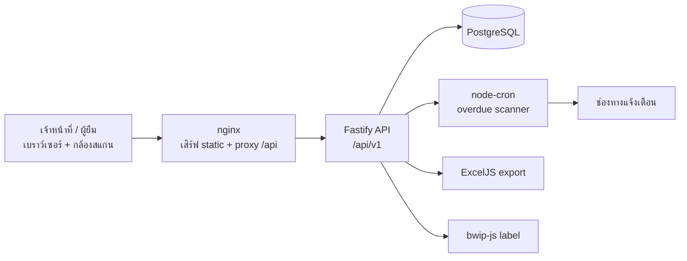

# IpdCharts — ระบบยืม-คืนเวชระเบียนผู้ป่วยใน

ระบบติดตามการยืม-คืนแฟ้มเวชระเบียนผู้ป่วยใน (IPD) สำหรับหน่วยงานเวชระเบียนของโรงพยาบาล
ออกแบบมาแทนการจดสมุด/Excel ด้วยการสแกน QR/Barcode, Dashboard เรียลไทม์ และการแจ้งเตือนแฟ้มเกินกำหนดอัตโนมัติ

> **สถานะ:** เฟส 1–3 (Core / Automation / Reporting) ใช้งานได้แล้ว
> ดูรายการที่ยังไม่ได้ทำที่หัวข้อ [สิ่งที่ยังไม่ได้ทำ](#สิ่งที่ยังไม่ได้ทำ)

---

## ปัญหาที่แก้

| เดิม | หลังใช้ระบบ |
|---|---|
| ไม่รู้ว่าแฟ้มอยู่กับใคร ต้องเปิดสมุดค้น | ค้นจาก HN / ชื่อผู้ป่วย / ชื่อผู้ยืม ได้ทันที |
| ไม่รู้ว่าแฟ้มไหนเลยกำหนดคืน | Dashboard แสดงจำนวนเกินกำหนดแบบเรียลไทม์ |
| ลืมทวงคืน | Cron สแกนทุกชั่วโมง + escalation ถึงหัวหน้าเมื่อค้างนาน |
| ตรวจสอบย้อนหลังไม่ได้ | Audit trail ราย HN + audit log ทุกธุรกรรม |
| ทำรายงานด้วยมือ | Export Excel พร้อมสรุปและไฮไลต์รายการเกินกำหนด |

---

## คุณสมบัติหลัก

### 🔐 การเข้าสู่ระบบและสิทธิ์ (RBAC)

- ล็อกอินด้วย username/password — รหัสผ่านเก็บเป็น bcrypt hash (cost 10)
- JWT (HS256) อายุ 12 ชั่วโมง ตรวจสอบทุก request และโหลดผู้ใช้จากฐานข้อมูลใหม่เสมอ
  (ปิดบัญชี/ลบผู้ใช้แล้ว token เดิมใช้ไม่ได้ทันที)
- ข้อความตอบกลับตอนล็อกอินผิดเหมือนกันทุกกรณี เพื่อกัน user enumeration
- 3 บทบาท:

  | Role | ความหมาย | สิทธิ์ |
  |---|---|---|
  | `ADMIN` | เจ้าหน้าที่เวชระเบียน | ยืม / คืน / พิมพ์ label / ออกรายงาน / ดูทุกอย่าง |
  | `BORROWER` | แพทย์ พยาบาล ผู้ยืม | ดู Dashboard, รายการแฟ้ม, ประวัติ |
  | `DEPARTMENT_HEAD` | หัวหน้าหน่วยงาน | เท่ากับ `BORROWER` + รับ escalation |

### 📤 บันทึกการยืม

- สแกน QR/Barcode ผ่านกล้องมือถือ/แท็บเล็ต (html5-qrcode) หรือพิมพ์ HN เอง — ไม่ต้องใช้ฮาร์ดแวร์เฉพาะ
- ตรวจสอบก่อนบันทึกทุกครั้ง: แฟ้มมีอยู่จริง, ยังว่าง (กันยืมซ้อน), ผู้ยืมมีอยู่และสังกัดหน่วยงาน, กำหนดคืนต้องเป็นอนาคต
- เขียนข้อมูลแบบ transaction — สร้างรายการยืม + เปลี่ยนสถานะแฟ้ม + เขียน audit log พร้อมกันหรือไม่เกิดเลย

### 📥 บันทึกการคืน

- สแกนรับคืน ปิดรายการพร้อม timestamp จริง
- บังคับให้ผู้คืนตรงกับผู้ยืม (`WRONG_RETURNER`) และกันการคืนซ้ำ (`ALREADY_RETURNED`)
- คืนแล้วแฟ้มกลับสู่สถานะ `AVAILABLE` อัตโนมัติ

### 📊 Dashboard เรียลไทม์

- การ์ดสรุป 5 ตัว: แฟ้มทั้งหมด / ว่างให้ยืม / อยู่ระหว่างยืม / เกินกำหนด / คืนวันนี้
- ตารางรายการเกินกำหนดพร้อม badge สี
- "คืนวันนี้" นับตามเที่ยงคืนโซน `Asia/Bangkok` ไม่ใช่ย้อนหลัง 24 ชั่วโมง

### 🔔 แจ้งเตือนแฟ้มเกินกำหนด

- Cron ทุกชั่วโมง สแกนรายการที่เลยกำหนด แล้วส่งแจ้งเตือน (จำกัด 3 ครั้ง/รายการ/วัน นับจาก audit log)
- Escalation: รวมรายการที่ค้างเกิน 14 วันเป็นสรุปชุดเดียว ส่งถึงหัวหน้าหน่วยงาน
- สรุปประจำวันทุก 08:00 น.
- ⚠️ ช่องทางที่เขียนไว้คือ LINE Notify ซึ่ง **LINE ปิดบริการถาวรแล้ว** — ต้องเปลี่ยนช่องทางก่อนใช้งานจริง (ดู [สิ่งที่ยังไม่ได้ทำ](#สิ่งที่ยังไม่ได้ทำ))

### 📁 ค้นหาแฟ้มและ Audit Trail

- ค้นหาแบบ substring จาก HN, ชื่อผู้ป่วย หรือชื่อผู้ยืม + กรองตามสถานะ
- หน้ารายละเอียดแฟ้มแสดงผู้ถือครองปัจจุบัน และประวัติการยืม-คืนทั้งหมดของแฟ้มนั้น
- ตาราง `AuditLog` บันทึกทุกธุรกรรม (`LOGIN`, `BORROW`, `RETURN`, `OVERDUE_NOTIFICATION`, `OVERDUE_ESCALATION`) พร้อมผู้กระทำและ payload

### 📄 รายงาน Excel

- `GET /api/v1/reports/borrows` สร้างไฟล์ `.xlsx` ผ่าน ExcelJS
- กรองตามช่วงวันที่และสถานะ, จัดรูปแบบหัวตาราง, ไฮไลต์แถวเกินกำหนด, วันที่แสดงแบบไทย
- มีบรรทัดสรุปจำนวนรายการและเวลาที่สร้างรายงาน

### 🏷️ พิมพ์ label QR/Barcode

- สร้าง PNG ของ Code128 หรือ QR จาก HN ผ่าน bwip-js สำหรับติดแฟ้มที่ยังไม่มีบาร์โค้ด
- รองรับการขอเป็นชุด (batch) สำหรับพิมพ์ทีละหลายแฟ้ม

### 🌐 UI

- ภาษาไทยทั้งหมด รวมถึงข้อความ error ที่ส่งมาจาก API
- Responsive — sidebar บนจอใหญ่, แถบบนบนมือถือ
- เมนูซ่อน/แสดงตามสิทธิ์ และมี route guard ฝั่ง client

---

## Tech Stack

| ชั้น | เทคโนโลยี |
|---|---|
| Frontend | React 19 + Vite 6 + TypeScript + TailwindCSS 4 + React Router 7 |
| Backend | Fastify 5 + TypeScript (ESM) |
| Database | PostgreSQL 16 + Prisma 6 |
| Auth | JWT (jose) + bcryptjs |
| สแกน | html5-qrcode |
| Label | bwip-js |
| รายงาน | ExcelJS |
| งานตามเวลา | node-cron |
| Validation | Zod |
| Test | `bun test` (integration) + Playwright (E2E) |
| Deploy | Docker Compose (nginx + Bun + PostgreSQL) |

TypeScript strict mode ทั้งโปรเจกต์ — ไม่มี `any`, `@ts-ignore` หรือ `@ts-expect-error`

---

## สถาปัตยกรรม



---

## เริ่มต้นใช้งาน (Development)

**ต้องมี:** [Bun](https://bun.sh) 1.2+ และ Docker

```bash
# 1) ติดตั้ง dependencies (bun workspace — ติดตั้งครั้งเดียวจาก root)
bun install

# 2) เปิดฐานข้อมูล (map host 5433 -> container 5432)
docker compose up -d db

# 3) ตั้งค่า environment
cp .env.example .env                 # สำหรับ docker compose
cp backend/.env.example backend/.env # สำหรับ dev server
# แก้ JWT_SECRET ให้ยาวอย่างน้อย 32 ตัวอักษร

# 4) สร้างตารางและใส่ข้อมูลตัวอย่าง
bun run db:migrate
bun run db:seed

# 5) รัน backend (:3000) + frontend (:5173) พร้อมกัน
bun run dev
```

เปิด http://localhost:5173 — Vite proxy `/api` ไปที่ `localhost:3000` ให้อัตโนมัติ

### บัญชีสำหรับทดลอง

หลังรัน `bun run db:seed` (รหัสผ่านเดียวกันทุกบัญชี: `password123`)

| Username | บทบาท | ชื่อ |
|---|---|---|
| `mr-admin` | ADMIN | นางสาวสมหญิง เจ้าหน้าที่เวชระเบียน |
| `nurse-mali` | BORROWER | นางสาวมาลี พยาบาล (ศัลยกรรม) |
| `dr-wichai` | BORROWER | นายแพทย์วิชัย แพทย์ (ICU) |
| `head-somchai` | DEPARTMENT_HEAD | นายสมชาย หัวหน้าศัลยกรรม |

ข้อมูลตัวอย่างมี 3 หน่วยงาน, 12 แฟ้ม และรายการยืม 3 แบบ (เกินกำหนด / ปกติ / คืนแล้ว)

> ⚠️ บัญชีเหล่านี้มีไว้สำหรับ dev เท่านั้น — อย่ารัน `db:seed` บนฐานข้อมูลจริง เพราะ seed จะ **ลบข้อมูลเดิมทั้งหมด** ก่อนใส่ข้อมูลใหม่

---

## Deploy (Production)

```bash
cp .env.example .env
# ตั้ง POSTGRES_PASSWORD และ JWT_SECRET เป็นค่าจริง (JWT_SECRET ต้อง >= 32 ตัวอักษร)

docker compose up -d --build
```

- frontend → `http://<host>` (พอร์ต 80)
- backend  → `http://<host>:3000/api/v1`
- คอนเทนเนอร์ backend รัน `prisma migrate deploy` ให้อัตโนมัติก่อนเปิดรับ request
- ถ้า `JWT_SECRET` ไม่ได้ตั้งหรือสั้นเกินไป backend จะปฏิเสธการ start พร้อมข้อความบอกสาเหตุ

**หมายเหตุการ build:** ทั้งสอง image ใช้ build context เป็น root ของ repo เพราะ `bun.lock` ของ workspace อยู่ที่ root

### ตัวแปร Environment

| ตัวแปร | ใช้ที่ | ค่าเริ่มต้น | หมายเหตุ |
|---|---|---|---|
| `POSTGRES_USER` | compose | `ipd` | |
| `POSTGRES_PASSWORD` | compose | `ipd_dev_password` | **ต้องเปลี่ยนบน production** |
| `POSTGRES_DB` | compose | `ipdcharts` | |
| `DATABASE_URL` | backend | — | connection string ของ Prisma |
| `JWT_SECRET` | backend | — | **บังคับ**, อย่างน้อย 32 ตัวอักษร |
| `PORT` | backend | `3000` | |
| `LINE_NOTIFY_TOKEN` | backend | ว่าง | ถ้าไม่ตั้ง ระบบจะข้ามการแจ้งเตือน |
| `IPDCHARTS_TEST_DATABASE_URL` | test | `...localhost:5433/ipdcharts_test` | |

---

## API

ทุก endpoint อยู่ใต้ `/api/v1` และต้องแนบ `Authorization: Bearer <token>` ยกเว้นที่ระบุว่าไม่ต้อง

| Method | Path | สิทธิ์ | คำอธิบาย |
|---|---|---|---|
| `GET` | `/health` | สาธารณะ | health check |
| `POST` | `/auth/login` | สาธารณะ | ล็อกอิน คืน token + ข้อมูลผู้ใช้ |
| `GET` | `/auth/me` | ทุก role | ข้อมูลผู้ใช้ปัจจุบัน (ใช้ตรวจ token) |
| `GET` | `/stats` | ทุก role | ตัวเลขสรุปสำหรับ Dashboard |
| `GET` | `/users` | ทุก role | รายชื่อผู้ใช้งาน |
| `GET` | `/medical-records` | ทุก role | ค้นหาแฟ้ม (`?search=`, `?status=`) |
| `GET` | `/medical-records/:id` | ทุก role | รายละเอียด + ประวัติการยืม-คืน |
| `GET` | `/borrows` | ทุก role | รายการยืม (`?status=ACTIVE\|RETURNED\|OVERDUE`, `?search=`) |
| `POST` | `/borrows` | ADMIN | บันทึกการยืม |
| `POST` | `/borrows/:id/return` | ADMIN | บันทึกการคืน |
| `GET` | `/labels` | ADMIN | PNG barcode/QR (`?hn=&type=barcode\|qrcode`) |
| `POST` | `/labels/batch` | ADMIN | ขอ label หลายแฟ้ม |
| `GET` | `/reports/borrows` | ADMIN | ดาวน์โหลดรายงาน `.xlsx` |

### รูปแบบ error

ทุก error ตอบกลับรูปแบบเดียวกัน พร้อมข้อความภาษาไทยที่แสดงให้ผู้ใช้ได้ทันที

```json
{ "error": { "code": "RECORD_NOT_AVAILABLE", "message": "แฟ้มนี้ถูกยืมอยู่แล้ว ไม่สามารถยืมซ้ำได้" } }
```

โค้ดที่ใช้: `VALIDATION_ERROR`, `UNAUTHORIZED`, `FORBIDDEN`, `INVALID_CREDENTIALS`, `RECORD_NOT_FOUND`,
`RECORD_NOT_AVAILABLE`, `BORROW_NOT_FOUND`, `ALREADY_RETURNED`, `WRONG_RETURNER`, `BORROWER_NOT_FOUND`,
`BORROWER_NO_DEPARTMENT`, `INVALID_DUE_DATE`, `NOT_FOUND`, `INTERNAL_ERROR`

---

## กติกาทางธุรกิจ

| กติกา | ค่า | อ้างอิง |
|---|---|---|
| ผ่อนผันก่อนนับว่าเกินกำหนด | 7 วันหลัง `dueDate` | `OVERDUE_GRACE_DAYS` |
| เกณฑ์ escalation ถึงหัวหน้า | เกินกำหนด 14 วัน | `ESCALATION_DAYS` |
| จำกัดการแจ้งเตือน | 3 ครั้ง/รายการ/วัน | `MAX_NOTIFICATIONS_PER_BORROW` |
| อายุ token | 12 ชั่วโมง | `TOKEN_TTL_SECONDS` |
| รอบสแกนเกินกำหนด | ทุกชั่วโมง (นาทีที่ 0) | `server.ts` |
| รอบสรุปประจำวัน | 08:00 น. | `server.ts` |
| Time zone แสดงผล | `Asia/Bangkok` (เก็บใน DB เป็น UTC) | |
| รูปแบบ HN | ตัวเลข 8–10 หลัก | `borrowBodySchema` |

---

## การทดสอบ

```bash
bun run typecheck   # tsc --noEmit ทั้ง backend และ frontend
bun run test        # integration tests (ต้องมี PostgreSQL รันอยู่)
```

Integration test ยิงผ่าน `app.inject()` ไปยัง Fastify จริงและใช้ PostgreSQL จริง (ฐาน `ipdcharts_test`)
ครอบคลุม happy path, กรณี error ทุกแบบ, การคำนวณ overdue, การนับสถิติ
และ **auth/RBAC จริง** — ทุกเทสต์ออก JWT ผ่านเส้นทางเดียวกับ production ไม่มีการ bypass

```bash
# E2E (ต้องเปิด backend + frontend ไว้ก่อน)
bun run --cwd backend test:e2e
```

---

## โครงสร้างโปรเจกต์

```
IpdCharts/
├── prd/prd.md                  # PRD — แหล่ง requirements
├── AGENTS.md                   # แนวทางสำหรับ AI agent ที่ทำงานกับ repo นี้
├── docker-compose.yml          # db + backend + frontend
├── backend/
│   ├── prisma/
│   │   ├── schema.prisma       # User, Department, MedicalRecord, Borrow, AuditLog
│   │   ├── migrations/
│   │   └── seed.ts
│   ├── src/
│   │   ├── app.ts              # ประกอบ Fastify + error handler กลาง
│   │   ├── server.ts           # ตรวจ config, listen, ตั้ง cron
│   │   ├── lib/                # auth, domain (กติกา overdue), errors, notifications, overdue-scanner
│   │   ├── routes/             # health, auth, records, borrows, users, stats, labels, reports
│   │   └── test/               # helper สำหรับ integration test
│   └── e2e/                    # Playwright
└── frontend/
    ├── nginx.conf              # SPA fallback + proxy /api
    └── src/
        ├── lib/                # api client, auth context, format, cn
        ├── components/         # ui primitives, QrScanner
        └── pages/              # Login, Dashboard, Borrow, Return, Records, RecordDetail, Admin
```

---

## สิ่งที่ยังไม่ได้ทำ

รายการที่อยู่ใน PRD แต่ยังไม่ได้พัฒนา หรือพัฒนาแล้วแต่ยังใช้งานจริงไม่ได้

- **ช่องทางแจ้งเตือน** — โค้ดเรียก LINE Notify ซึ่งปิดบริการถาวรแล้ว ต้องย้ายไป LINE Messaging API หรือ SMTP
  และต้องเพิ่มฟิลด์ช่องทางติดต่อรายบุคคลใน `User` ก่อน (ตอนนี้ส่งได้เฉพาะ token กลางตัวเดียว ไม่ใช่ถึงผู้ยืมโดยตรง)
- **Workflow อนุมัติกรณีพิเศษ** (FR-03) — ยังไม่มี สถานะการยืมมีแค่ `ACTIVE` / `RETURNED`
- **บันทึกแฟ้มชำรุด/สูญหาย** (FR-05) — ยังไม่มี สถานะแฟ้มมีแค่ `AVAILABLE` / `BORROWED`
- **ระยะเวลายืมตามประเภทคำขอ** (FR-02) — ตอนนี้ผู้บันทึกกำหนด `dueDate` เอง ยังไม่มีนโยบายปกติ/ด่วน
- **จัดการผู้ใช้งาน** (FR-11) — หน้า Admin ดูรายชื่อได้อย่างเดียว ยังไม่มีเพิ่ม/แก้ไข/ลบ/รีเซ็ตรหัสผ่าน
- **UI ของรายงานและ label** — API พร้อมแล้ว แต่ยังไม่มีหน้าจอเรียกใช้
- **Hardening** — ยังไม่มี rate limit ที่ `/auth/login`, CORS ยังเปิดรับทุก origin, audit log ยังไม่บันทึกการ *อ่าน* ข้อมูลผู้ป่วย (NFR ด้าน PDPA)
- **Backup อัตโนมัติ** ของฐานข้อมูล
