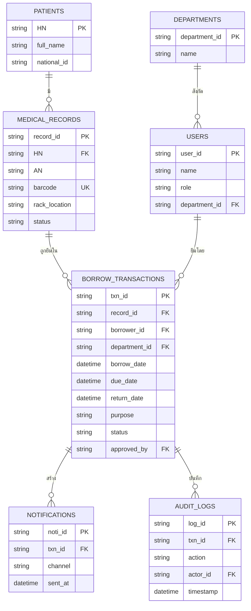
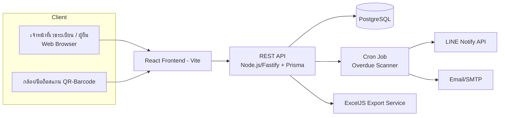

# PRD: ระบบยืมคืนเวชระเบียนผู้ป่วยใน (IPD Medical Record Borrow-Return Tracking System)

| Document Control | |
|---|---|
| **Version** | 1.0 |
| **Status** | Draft — รอยืนยันกับผู้ใช้งานจริง (ดูหัวข้อ 12) |
| **Product Owner** | หน่วยงานเวชระเบียน |
| **Frontend Stack** | React (Vite) + TypeScript + TailwindCSS + shadcn/ui |
| **Backend Stack** | Node.js + Fastify + Prisma + PostgreSQL |

---

## 1. Overview

### 1.1 Problem Statement
ปัจจุบันการยืม-คืนเวชระเบียนผู้ป่วยใน (IPD) บริหารจัดการด้วยสมุดบันทึก/Excel ทำให้ไม่สามารถทราบได้แบบเรียลไทม์ว่าเวชระเบียนฉบับใดถูกยืมอยู่ ยืมโดยใคร ยืมมานานเท่าใด และเลยกำหนดส่งคืนหรือยัง ส่งผลให้เวชระเบียนสูญหาย/ค้างนาน และตรวจสอบย้อนหลังทำได้ยาก

### 1.2 Product Vision
ระบบเว็บแอปพลิเคชันที่ให้เจ้าหน้าที่เวชระเบียนบันทึกการยืม-คืนผ่านการสแกน QR/Barcode พร้อม Dashboard ติดตามสถานะแบบเรียลไทม์ และแจ้งเตือนอัตโนมัติเมื่อเลยกำหนด

### 1.3 Scope
เฉพาะเวชระเบียนผู้ป่วยใน (IPD) รูปแบบแฟ้มกระดาษ ในเฟสแรก — ดูรายละเอียด Out of Scope ในหัวข้อ 9

---

## 2. Goals & Success Metrics

| เป้าหมาย | Metric | Baseline | Target (หลัง Go-live 3 เดือน) |
|---|---|---|---|
| ลดเวชระเบียนสูญหาย/ค้างนาน | จำนวนแฟ้มเกินกำหนด >7 วัน | ไม่มีข้อมูล (manual) | ลดลง ≥80% |
| ติดตามสถานะได้ทันที | เวลาค้นหาว่าแฟ้มอยู่ที่ใคร | หลายนาที (ค้นสมุด) | <10 วินาที |
| คืนตรงเวลาเพิ่มขึ้น | % รายการคืนตรงกำหนด | ไม่มีข้อมูล | ≥90% |
| Adoption | % การยืม-คืนที่บันทึกผ่านระบบ (ไม่ใช้สมุดคู่ขนาน) | 0% | 100% ภายในเดือนแรกหลัง go-live |

---

## 3. Target Users / Personas

| Persona | บทบาท | Pain Point หลัก |
|---|---|---|
| **เจ้าหน้าที่เวชระเบียน** | บันทึกยืม-คืน, ดูแลแฟ้ม | ตามหาแฟ้ม/ผู้ยืมด้วยมือ เสียเวลา |
| **แพทย์/พยาบาลผู้ยืม** | ยืมแฟ้มเพื่อสรุปเวชระเบียน/ใช้งาน | ไม่รู้ว่าต้องคืนวันไหน ลืมคืน |
| **หัวหน้าหน่วยงานเวชระเบียน** | ดูภาพรวม, อนุมัติกรณีพิเศษ | ไม่มีรายงานสถิติเชิงบริหาร |
| **ผู้บริหารโรงพยาบาล** | ดู Dashboard สรุป | ไม่มีข้อมูลประกอบการตัดสินใจ |

---

## 4. User Stories & Acceptance Criteria

### Epic 1: การยืมเวชระเบียน (Borrow)

**US-01** (P0) — ในฐานะเจ้าหน้าที่เวชระเบียน ฉันต้องการสแกน QR/Barcode ของแฟ้มและผู้ยืม เพื่อบันทึกการยืมได้รวดเร็วโดยไม่ต้องพิมพ์
- Given เจ้าหน้าที่อยู่หน้าจอ "บันทึกการยืม"
- When สแกน barcode แฟ้ม และเลือก/สแกนผู้ยืม แล้วกดยืนยัน
- Then ระบบสร้างรายการยืม พร้อมตั้งวันครบกำหนดคืนอัตโนมัติตามนโยบาย

**US-02** (P0) — ในฐานะเจ้าหน้าที่เวชระเบียน ฉันต้องการกำหนดระยะเวลายืมต่างกันตามประเภทคำขอ (ปกติ/ด่วน) เพื่อให้สอดคล้องกับนโยบายจริง
- Given กำลังบันทึกการยืม
- When เลือกประเภทคำขอ "ด่วน"
- Then วันครบกำหนดคำนวณจากนโยบายของประเภทนั้น (เช่น 1 วันทำการ แทน 3 วัน)

**US-03** (P1) — ในฐานะหัวหน้าหน่วยงาน ฉันต้องการอนุมัติคำขอยืมกรณีพิเศษ (เช่น ยืมออกนอกโรงพยาบาล) ก่อนเจ้าหน้าที่จ่ายแฟ้ม
- Given คำขอถูกทำเครื่องหมายว่าต้องอนุมัติ
- When หัวหน้าหน่วยงานกดอนุมัติ
- Then สถานะเปลี่ยนเป็น "พร้อมจ่าย" และเจ้าหน้าที่จึงสแกนออกได้

### Epic 2: การคืนเวชระเบียน (Return)

**US-04** (P0) — ในฐานะเจ้าหน้าที่เวชระเบียน ฉันต้องการสแกนรับคืนแฟ้ม เพื่อปิดรายการยืมและบันทึกเวลาที่คืนจริง
- Given แฟ้มมีสถานะ "กำลังถูกยืม"
- When เจ้าหน้าที่สแกน barcode แฟ้มที่หน้าจอ "รับคืน"
- Then สถานะเปลี่ยนเป็น "คืนแล้ว" พร้อม timestamp

**US-05** (P1) — ในฐานะเจ้าหน้าที่เวชระเบียน ฉันต้องการบันทึกกรณีแฟ้มชำรุด/สูญหาย เพื่อเปิด incident ติดตามแก้ไข
- Given กำลังรับคืนแฟ้ม
- When เลือกสภาพ "ชำรุด" หรือกด "รายงานสูญหาย" แทนการสแกนรับคืน
- Then ระบบสร้าง incident record และแจ้งผู้เกี่ยวข้อง

### Epic 3: การมอนิเตอร์และแจ้งเตือน (Monitoring & Alerts)

**US-06** (P0) — ในฐานะเจ้าหน้าที่/หัวหน้าหน่วยงาน ฉันต้องการเห็น Dashboard แสดงผู้ยืม, ฉบับที่ยืม, จำนวนวันที่ยืมมาแล้ว และสถานะเกินกำหนดหรือไม่ แบบเรียลไทม์
- Given เข้าหน้า Dashboard
- When ระบบโหลดข้อมูล
- Then แสดงตารางพร้อม badge สี (เขียว=ปกติ, เหลือง=ใกล้ครบกำหนด, แดง=เกินกำหนด) และ filter/sort ตามสถานะได้

**US-07** (P0) — ในฐานะผู้ยืม ฉันต้องการได้รับแจ้งเตือนผ่าน LINE/Email เมื่อเลยกำหนดคืน เพื่อรีบนำแฟ้มมาคืน
- Given มีรายการยืมที่เลยวันครบกำหนด
- When job ตรวจสอบรายวันทำงาน
- Then ระบบส่งแจ้งเตือนไปยังผู้ยืมทันที และแจ้งซ้ำหากยังไม่คืนภายใน X วันถัดมา

**US-08** (P1) — ในฐานะหัวหน้าหน่วยงานเวชระเบียน ฉันต้องการได้รับแจ้งเตือน escalation เมื่อรายการเลยกำหนดนานเกินเกณฑ์ เพื่อติดตามเป็นกรณีพิเศษ
- Given รายการเลยกำหนดเกิน N วัน (ค่ากำหนดได้)
- When job ตรวจพบ
- Then ส่งแจ้งเตือนถึงหัวหน้าหน่วยงานเพิ่มเติมจากผู้ยืม

### Epic 4: รายงานและสถิติ (Reports)

**US-09** (P1) — ในฐานะผู้บริหาร/หัวหน้าหน่วยงาน ฉันต้องการดูรายงานอัตราคืนตรงเวลาและหน่วยงานที่ยืมบ่อย/นานผิดปกติ เพื่อใช้ปรับปรุงกระบวนการ
- Given เข้าหน้ารายงาน เลือกช่วงวันที่
- When กดสร้างรายงาน
- Then แสดงสถิติและสามารถ Export เป็น Excel ได้

**US-10** (P2) — ในฐานะเจ้าหน้าที่เวชระเบียน ฉันต้องการดูประวัติการยืม-คืนทั้งหมดของแฟ้มใดแฟ้มหนึ่ง (Audit Trail) เพื่อตรวจสอบย้อนหลังกรณีมีข้อพิพาท

### Epic 5: Master Data & Admin

**US-11** (P0) — ในฐานะ Admin ฉันต้องการจัดการข้อมูลผู้ใช้งานและกำหนดสิทธิ์ตาม Role (RBAC)

**US-12** (P1) — ในฐานะเจ้าหน้าที่เวชระเบียน ฉันต้องการพิมพ์ label QR/Barcode สำหรับแฟ้มเวชระเบียนใหม่หรือแฟ้มเดิมที่ยังไม่มีบาร์โค้ด

---

## 5. Functional Requirements Summary

| FR ID | Requirement | เกี่ยวข้องกับ User Story | Priority |
|---|---|---|---|
| FR-01 | บันทึกการยืมด้วยการสแกน QR/Barcode | US-01 | P0 |
| FR-02 | คำนวณวันครบกำหนดคืนอัตโนมัติตามนโยบาย/ประเภทคำขอ | US-02 | P0 |
| FR-03 | Workflow อนุมัติสำหรับกรณีพิเศษ | US-03 | P1 |
| FR-04 | บันทึกการคืนด้วยการสแกน | US-04 | P0 |
| FR-05 | บันทึก/ติดตามกรณีชำรุด-สูญหาย | US-05 | P1 |
| FR-06 | Dashboard เรียลไทม์: ผู้ยืม/ฉบับที่ยืม/จำนวนวัน/สถานะเกินกำหนด | US-06 | P0 |
| FR-07 | แจ้งเตือนอัตโนมัติผ่าน LINE Notify/Email เมื่อเกินกำหนด | US-07 | P0 |
| FR-08 | Escalation แจ้งหัวหน้าหน่วยงานเมื่อเกินกำหนดนาน | US-08 | P1 |
| FR-09 | รายงานสถิติ + Export Excel | US-09 | P1 |
| FR-10 | Audit Trail รายแฟ้ม/รายผู้ใช้ | US-10 | P2 |
| FR-11 | จัดการผู้ใช้งานและ RBAC | US-11 | P0 |
| FR-12 | สร้าง/พิมพ์ label QR-Barcode | US-12 | P1 |

---

## 6. Non-Functional Requirements

| หัวข้อ | ข้อกำหนด |
|---|---|
| **PDPA / ความปลอดภัย** | ข้อมูล HN/ชื่อผู้ป่วยเป็นข้อมูลอ่อนไหว ต้องมี RBAC, audit log ทุกการเข้าถึง, HTTPS |
| **Deployment** | On-premise ภายในเครือข่ายโรงพยาบาล |
| **Performance** | รองรับผู้ใช้พร้อมกันช่วงเปลี่ยนเวร/ราวน์วอร์ด |
| **Availability** | Backup ฐานข้อมูลรายวัน |
| **Usability** | Responsive ใช้งานได้ทั้งคอมพิวเตอร์/แท็บเล็ต/มือถือ สแกนผ่านกล้องได้โดยไม่ต้องใช้ฮาร์ดแวร์เฉพาะ |

---

## 7. Data Model (ERD)

---

## 8. Technical Architecture & Stack

| ส่วนประกอบ | เทคโนโลยี |
|---|---|
| Frontend | React (Vite) + TypeScript + TailwindCSS + shadcn/ui |
| Routing | React Router v6 |
| Backend / API | Node.js + Fastify + TypeScript |
| ORM | Prisma |
| Database | PostgreSQL |
| Auth | JWT + Context/Zustand (client) + RBAC middleware (API) |
| Barcode/QR Scan | html5-qrcode |
| Label Generation | bwip-js / qrcode |
| Scheduled Job | node-cron (→ BullMQ + Redis เมื่อ scale ขึ้น) |
| แจ้งเตือน | LINE Notify API + Nodemailer (SMTP) |
| Export รายงาน | ExcelJS |
| Deployment | Docker Compose บน on-prem server |

*ทางเลือก Backend: FastAPI + SQLAlchemy หากทีมถนัด Python มากกว่า*

---

## 9. Out of Scope (เฟสนี้)

- ระบบเวชระเบียนดิจิทัลเต็มรูปแบบ (EMR/สแกนเก็บไฟล์)
- เวชระเบียนผู้ป่วยนอก (OPD) — ออกแบบโครงสร้างให้ขยายรองรับได้ในอนาคต แต่ไม่พัฒนาในเฟสนี้
- การเชื่อมต่อ HIS แบบ real-time integration (เฟสแรกกรอก/ค้นหา HN เองในระบบ)
- Native Mobile Application (ใช้ Responsive Web แทน)

---

## 10. Risks & Mitigations

| ความเสี่ยง | ผลกระทบ | แนวทางลด |
|---|---|---|
| เจ้าหน้าที่ไม่ใช้ระบบ ใช้สมุดคู่ขนาน | ข้อมูลไม่ครบ ระบบไร้ประโยชน์ | อบรม + บังคับใช้เป็นขั้นตอนมาตรฐาน + UX เร็วกว่าสมุด |
| แฟ้มเดิมจำนวนมากยังไม่มีบาร์โค้ด | ยืมผ่านระบบไม่ได้ครบ 100% ช่วงเริ่มต้น | แผนติด label ไล่ตามรอบยืม-คืนจริง (retrofit ระหว่างใช้งาน) |
| เครือข่าย/เซิร์ฟเวอร์ on-prem ล่ม | ใช้งานระบบไม่ได้ | มีแผนสำรอง (fallback เป็นบันทึกกระดาษชั่วคราว) + backup/DR |
| LINE Notify ถูกปิดใช้งาน/เปลี่ยนนโยบาย API | แจ้งเตือนหยุดทำงาน | มี Email เป็นช่องทางสำรองเสมอ |

---

## 11. Release Plan

| เฟส | ระยะเวลา | Exit Criteria |
|---|---|---|
| เฟส 1 – Core | 4–6 สัปดาห์ | ยืม-คืนบันทึกได้ครบ, Dashboard พื้นฐานแสดงผลถูกต้อง, RBAC ใช้งานได้ |
| เฟส 2 – Automation | 2–3 สัปดาห์ | สแกน QR/Barcode ใช้งานจริงได้, แจ้งเตือนอัตโนมัติทำงานถูกต้องตามเงื่อนไข |
| เฟส 3 – Reporting | 2 สัปดาห์ | รายงาน/Export ครบตาม FR-09, Audit Trail สมบูรณ์ |
| เฟส 4 – UAT & Go-live | 1–2 สัปดาห์ | ผู้ใช้จริงทดสอบผ่าน, อบรมเจ้าหน้าที่แล้ว, ขึ้นระบบจริง |

---

## 12. Open Questions (ต้องยืนยันก่อนเริ่มพัฒนา)

1. เวชระเบียนที่ใช้เป็นแฟ้มกระดาษทั้งหมดใช่หรือไม่ — ต้องเตรียมเครื่องพิมพ์ label บาร์โค้ด
2. มีระบบ HIS เดิม (เช่น HOSxP) หรือไม่ ต้องการเชื่อม HN อัตโนมัติในอนาคตหรือไม่
3. นโยบายระยะเวลายืมมีกี่ประเภท และแต่ละประเภทกี่วัน
4. ต้องอนุมัติก่อนยืมทุกครั้งหรือเฉพาะกรณีพิเศษ (เช่น ยืมออกนอกโรงพยาบาล)
5. ปริมาณแฟ้มที่หมุนเวียนต่อวัน/เดือน เพื่อประเมิน sizing เซิร์ฟเวอร์
